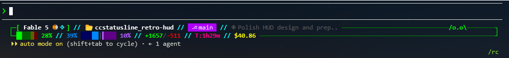

# 🎮 retro-hud

> A retro sci-fi HUD status line for [Claude Code](https://claude.com/claude-code) — neon wireframe, zoned gauges, and a resident alien.




Two rows in a closed $\color{#00ff00}{\textsf{neon green}}$ wireframe with
$\color{#00ffff}{\textsf{cyan}}$ `//` separators, showing every number Claude
Code will give you — rendered with width-aware degradation so it never
overflows, and a top-level guard so a malformed payload degrades gracefully
instead of crashing.

## Quick start

```bash
git clone https://github.com/codyslater/ccstatusline_retro-hud.git
cd ccstatusline_retro-hud
bash install.sh     # backs up settings.json before touching it
```

Restart Claude Code. Preview any time without it:

```bash
python3 statusline.py --demo
```

To remove: `bash uninstall.sh`.

**Requirements:** Python 3.6+ (stdlib only, no subprocesses), Claude Code
2.1.153+, a 256-color terminal. A font with fractional block characters
(JetBrains Mono, Fira Code, any Nerd Font) makes the gauges crisp.

## What it shows

### Row 1 — identity

| Segment | Looks like | Appears |
|---------|-----------|---------|
| Model + effort + thinking | `[ Fable 5 ◉ ✧ ]` — dot scales `·` `•` `●` `◉` `✦` with effort level, `✧` = extended thinking | always |
| Directory | `📂 my-project` | always |
| Git branch | `⎇ main` on a $\color{#af00ff}{\textsf{purple}}$ badge, hyperlinked to the repo | in a git repo (read straight from `.git` — works in worktrees and on detached HEADs) |
| Pull request | `#42✓` — ✓ $\color{#00ff00}{\textsf{approved}}$, ○ $\color{#ffff00}{\textsf{pending}}$, ✗ $\color{#ff0000}{\textsf{changes requested}}$, ◌ draft; hyperlinked | while a PR is open for the branch |
| Vim mode | `[N]` `[I]` `[V]` | vim mode enabled |
| Session name | `◈ fix-login-flow` (capped at 28 cols) | named sessions, wide terminals |

### Row 2 — instruments

| Segment | Looks like | Appears |
|---------|-----------|---------|
| Context gauge | $\color{#00ff00}{\textsf{green}}$ / $\color{#ff8700}{\textsf{amber}}$ / $\color{#ff0000}{\textsf{red}}$ zoned track with fractional fill, `72%` | always |
| Context tokens | `144.2K/200K` (or `/1M`) | from the amber zone up, when headroom is an actionable number (`RETRO_HUD_CTX_TOKENS=always\|never` to pin) |
| Rate limits | mirrored gauges, $\color{#0087ff}{\textsf{blue}}$ 5h ←`██\|██`→ $\color{#af5fff}{\textsf{violet}}$ 7d | Claude subscription plans (hidden when the API reports none) |
| Lines changed | `+1447/-455` — $\color{#00ff00}{\textsf{green}}$ / $\color{#ff0000}{\textsf{red}}$ | when nonzero |
| Cache hit rate | `cache 94%` in $\color{#00ffff}{\textsf{cyan}}$ | terminals ≥ 140 cols |
| Duration / cost | `T:1h29m` in $\color{#ff0087}{\textsf{pink}}$ / `$40.86` in $\color{#ffff00}{\textsf{yellow}}$ | always |
| Agent / worktree | `▐█ reviewer` in $\color{#00ffff}{\textsf{cyan}}$ / `⎇ feature-x` in $\color{#ff0087}{\textsf{pink}}$ | `--agent` / `--worktree` sessions |

### Rate-limit label escalation

| Usage | Label behavior |
|-------|----------------|
| < 75% | cycles `35%` ↔ `2h45m` every 30s — the gauge stretches to absorb the width difference, so nothing shifts on a flip |
| 75–89% | pins to the combined `81% · 3d` |
| ≥ 90% | countdown only, in $\color{#ff0000}{\textsf{red}}$ — the bar already screams the % |

### The resident alien

A text-art alien patrols the top frame rule, blinking as it ping-pongs.
It reacts to your **worst** gauge (context or either rate limit):

| Mood | Sprite | Trigger | Speed |
|------|--------|---------|-------|
| $\color{#00ff00}{\textsf{calm}}$ | `/o.o\` | all gauges < 70% | 1× |
| $\color{#ff8700}{\textsf{agitated}}$ | `>o.o<` | any gauge ≥ 70% | 2× |
| $\color{#ff0000}{\textsf{red alert}}$ | `\o.o/` | any gauge ≥ 90% | 4× |

Peripheral vision tells you something's hot before you read a number.
Ground it with `RETRO_HUD_ALIEN=0`.

## Configuration

Every decoration and disclosure rule has an env-var knob (`RETRO_HUD_*`),
and the installer sets `"refreshInterval": 5` so countdowns tick, the alien
patrols, and the frame re-fits within seconds of a terminal resize. See
**[docs/configuration.md](docs/configuration.md)** for the full knob table,
manual install, and the width troubleshooting guide (WSL2, VS Code).

## Development

```bash
python3 tests.py              # width sweeps, hostile payloads, CLI flags
python3 statusline.py --demo  # render with sample data
```

No dependencies, no subprocesses, no network — git state is read from
`.git/HEAD` and `.git/config` directly. Releases follow
[SemVer](https://semver.org) with `v`-prefixed tags; see
[CHANGELOG.md](CHANGELOG.md).

## License

MIT — see [LICENSE](LICENSE) © 2026 [Cody Slater](https://github.com/codyslater)
