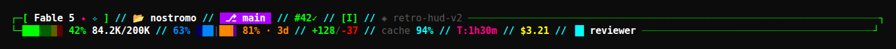

# 🎮 retro-hud

A retro sci-fi HUD status line theme for [Claude Code](https://claude.com/claude-code).



## Features

- Two-row HUD layout with $\color{#00ff00}{\textsf{green}}$ wireframe corners
- $\color{#00ffff}{\textsf{Neon cyan}}$ `//` separators
- Dynamic column sizing based on terminal width
- Context usage bar with color coding ($\color{#00ff00}{\textsf{green}}$ < 70%, $\color{#ff8700}{\textsf{orange}}$ < 90%, $\color{#ff0000}{\textsf{red}}$)
- Git branch with clickable GitHub link (OSC 8, supported in iTerm2/Kitty/WezTerm/Windows Terminal)
- Agent/worktree indicator when subagents are active
- Session cost and duration tracking

### Row 1
| Field | Color | Symbol |
|-------|-------|--------|
| Model | white in $\color{#00ff00}{\textsf{green}}$ `[ ]` box | |
| Session name | $\color{#ff0000}{\textsf{red}}$ | `>>` |
| Working directory | white | `[]` |
| Git branch | white on $\color{#af00ff}{\textsf{purple}}$ badge | `⎇` |

### Row 2
| Field | Color | Symbol |
|-------|-------|--------|
| Context % bar | $\color{#00ff00}{\textsf{green}}$ / $\color{#ff8700}{\textsf{orange}}$ / $\color{#ff0000}{\textsf{red}}$ | `█░` |
| Session cost | $\color{#ffff00}{\textsf{yellow}}$ | `$` |
| Duration | $\color{#ff0087}{\textsf{pink}}$ | `T:` |
| Agent status | $\color{#00ffff}{\textsf{cyan}}$ / white | `▐█` or `┄┄┄` idle |

## Requirements

- Python 3.6+
- Claude Code
- A terminal with 256-color support

## Install

```bash
git clone https://github.com/codyslater/ccstatusline_retro-hud.git
cd ccstatusline_retro-hud
bash install.sh
```

Then restart Claude Code.

## Manual Install

Copy `statusline.py` and `statusline-command.sh` to `~/.claude/`, then add to `~/.claude/settings.json`:

```json
{
  "statusLine": {
    "type": "command",
    "command": "bash ~/.claude/statusline-command.sh"
  }
}
```

## License

MIT
